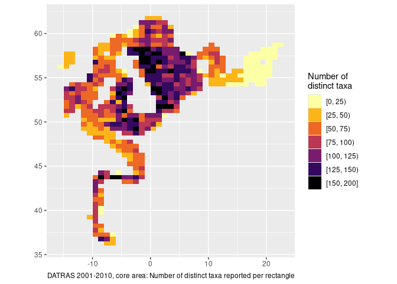

# obus

<!-- badges: start -->

[](https://lifecycle.r-lib.org/articles/stages.html#experimental)
[](https://CRAN.R-project.org/package=imbus)
<!-- badges: end -->

{obus} is a temporary experimental package used to explore various
DATRAS data connections and wrapper functions to make life a little
easier for everyday user. Some of this may be taken up in a more offical
package.

## Installation

You can install the development version of imbus from
[GitHub](https://github.com/einarhjorleifsson/obus) with:

``` r
# install.packages("pak")
#pak::pak("einarhjorleifsson/obus")
```

## Table connections

``` r
library(obus)
hh <- dr_con("HH")
hl <- dr_con("HL")
ca <- dr_con("CA")
```

## A little peek

``` r
library(tidyverse)
hl |> glimpse()
#> Rows: ??
#> Columns: 24
#> Database: DuckDB 1.4.3 [unknown@Linux 5.10.0-33-amd64:R 4.4.1/:memory:]
#> $ .id                  <chr> "BITS:2008:4:DK:26HI:TVS:1874:23", "BITS:1997:4:S…
#> $ SpecCodeType         <chr> "W", "W", "W", "W", "W", "W", "W", "W", "W", "W",…
#> $ SpecCode             <chr> "127143", "126425", "126425", "126425", "126425",…
#> $ SpecVal              <chr> "1", "1", "1", "1", "1", "1", "1", "1", "1", "1",…
#> $ Sex                  <chr> NA, NA, NA, NA, NA, NA, NA, NA, NA, NA, NA, NA, N…
#> $ TotalNo              <dbl> 19.00, 1571.11, 1571.11, 1571.11, 1571.11, 10.00,…
#> $ CatIdentifier        <int> 1, 1, 1, 1, 1, 1, 1, 1, 1, 1, 1, 1, 1, 1, 1, 1, 1…
#> $ NoMeas               <int> 19, 42, 42, 42, 42, 5, 29, 29, 29, 5, 5, 5, 210, …
#> $ SubFactor            <dbl> 1.0000, 1.0000, 1.0000, 1.0000, 1.0000, 1.0000, 1…
#> $ SubWgt               <int> 2500, NA, NA, NA, NA, NA, 1600, 1600, 1600, NA, N…
#> $ CatCatchWgt          <int> 2500, 20200, 20200, 20200, 20200, 2700, 1600, 160…
#> $ LngtCode             <chr> ".", "0", "0", "0", "0", "1", ".", ".", ".", "1",…
#> $ LngtClass            <int> 260, 145, 145, 150, 150, 23, 200, 210, 220, 27, 2…
#> $ HLNoAtLngt           <dbl> 1.00, 112.22, 112.22, 74.81, 74.81, 2.00, 2.00, 1…
#> $ DevStage             <chr> NA, NA, NA, NA, NA, NA, NA, NA, NA, NA, NA, NA, N…
#> $ LenMeasType          <chr> NA, NA, NA, NA, NA, NA, NA, NA, NA, NA, NA, NA, N…
#> $ ValidAphiaID         <chr> "127143", "126425", "126425", "126425", "126425",…
#> $ ScientificName_WoRMS <chr> "Pleuronectes platessa", "Sprattus sprattus", "Sp…
#> $ DateofCalculation    <chr> "20180507", "20161115", "20161115", "20161115", "…
#> $ .datatype            <chr> "R", "C", "C", "C", "C", "C", "R", "R", "R", "C",…
#> $ .effort              <int> 30, 30, 30, 30, 30, 30, 30, 30, 30, 30, 30, 30, 3…
#> $ n                    <dbl> 1.000, 56.110, 56.110, 37.405, 37.405, 1.000, 2.0…
#> $ cpue                 <dbl> 2.00, 112.22, 112.22, 74.81, 74.81, 2.00, 4.00, 2…
#> $ length               <dbl> 26, 14, 14, 15, 15, 23, 20, 21, 22, 27, 29, 30, 2…
```

## A little exploration

``` r
library(santoku)
#> 
#> Attaching package: 'santoku'
#> The following object is masked from 'package:tidyr':
#> 
#>     chop
# Grid resolution
dx <- 1
dy <- dx / 2
# Limit analysis to certain time and space
hh |> 
  filter(Year %in% 2001:2010,
         between(ShootLong, -20, 25),
         between(ShootLat, -Inf, 65)) |> 
  # assign coordinates to grid
  mutate(lon = ShootLong%/%dx * dx + dx/2,
         lat = ShootLat%/%dy * dy + dy/2) |> 
  left_join(hl |> 
              select(.id, ScientificName_WoRMS),
           by = join_by(.id)) |>
  # analyse by grid
  group_by(lon, lat) |> 
  summarise(n_taxa = n_distinct(ScientificName_WoRMS),
            .groups = "drop") |> 
  # load data into R memory because santoku::chop not in duckdb lingo
  #  chop is also nicer than cut - keeps things more orderly
  collect() |> 
  mutate(n_taxa = chop(n_taxa, breaks = c(0, 25, 50, 75, 100, 125, 150, 200))) |> 
  ggplot(aes(lon, lat, fill = n_taxa)) +
  geom_tile() +
  scale_fill_viridis_d(option = "inferno", direction = -1) +
  coord_quickmap() +
  labs(x = NULL, y = NULL, fill = "Number of\ndistinct taxa",
       caption = "DATRAS 2001-2010, core area: Number of distinct taxa reported per rectangle")
```


