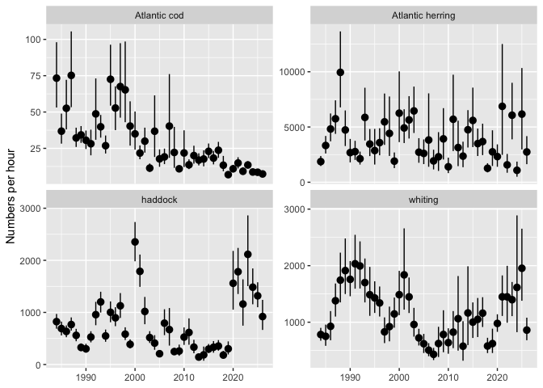

# obus

<!-- badges: start -->

[](https://lifecycle.r-lib.org/articles/stages.html#experimental)
<!-- badges: end -->

{obus} is a temporary experimental package used to explore various
DATRAS data connections and wrapper functions to make life a little
easier for the ordinary user. Some of that may be taken up in a more
official package. Or possibly not. So far {obus} does actually very
little, but hopefully well.

The package code resides on
[GitHub](https://github.com/einarhjorleifsson/obus).

For purists, one regrets to inform that the functionality of {obus}
rests on a quite substantial number of dependencies (see
[DESCRIPTION](https://raw.githubusercontent.com/einarhjorleifsson/obus/refs/heads/main/DESCRIPTION)
for the full list). Some of them may possibly be trimmed, but never all.

Access to the parquet datafiles is, however, independent of {obus} and,
for that matter, of any software platform used. The current
**temporary** path to the data (with the new header lingo) used in
{obus} is:

    # The exchange files:
    https://heima.hafro.is/~einarhj/datras/raw/HH.parquet
    https://heima.hafro.is/~einarhj/datras/raw/HL.parquet
    https://heima.hafro.is/~einarhj/datras/raw/CA.parquet
    # Auxiliary files:
    https://heima.hafro.is/~einarhj/datras/species.parquet
    ...
    # Experimentation with standardization of the HL data:
    https://heima.hafro.is/~einarhj/datras/HL_length.parquet
    https://heima.hafro.is/~einarhj/datras/HL_summary.parquet

One way to access these is just using {duckdb}/{duckdbfs}:

``` r
duckdbfs::open_dataset("https://heima.hafro.is/~einarhj/datras/raw/HH.parquet") |> dplyr::glimpse()
#> Rows: ??
#> Columns: 69
#> $ RecordHeader            <chr> "HH", "HH", "HH", "HH", "HH", "HH", "HH", "HH"…
#> $ Survey                  <chr> "BITS", "BITS", "BITS", "BITS", "BITS", "BITS"…
#> $ Quarter                 <int> 1, 1, 1, 1, 1, 1, 1, 1, 1, 1, 1, 1, 1, 1, 1, 1…
#> $ Country                 <chr> "DK", "DK", "DK", "DK", "DK", "DK", "DK", "DK"…
#> $ Platform                <chr> "26D4", "26D4", "26D4", "26D4", "26D4", "26D4"…
#> $ Gear                    <chr> "CAM", "CAM", "CAM", "EXP", "EXP", "GRT", "GRT…
#> $ SweepLength             <int> NA, NA, NA, 110, 110, NA, NA, NA, NA, NA, NA, …
#> $ GearExceptions          <chr> NA, NA, NA, NA, NA, NA, NA, NA, NA, NA, NA, NA…
#> $ DoorType                <chr> NA, NA, NA, NA, NA, NA, NA, NA, NA, NA, NA, NA…
#> $ StationName             <chr> "150", "151", "152", "149", "147", "10", "101"…
#> $ HaulNumber              <int> 67, 68, 69, 66, 65, 8, 54, 2, 55, 56, 57, 59, …
#> $ Year                    <int> 1991, 1991, 1991, 1991, 1991, 1991, 1991, 1991…
#> $ Month                   <int> 3, 3, 3, 3, 3, 3, 3, 3, 3, 3, 3, 3, 3, 3, 3, 3…
#> $ Day                     <int> 20, 20, 20, 19, 19, 6, 17, 5, 17, 17, 17, 17, …
#> $ StartTime               <chr> "0514", "0644", "0923", "2128", "1829", "1417"…
#> $ DepthStratum            <chr> "11", "11", "12", "12", "12", "10", "11", "9",…
#> $ HaulDuration            <int> 60, 60, 60, 60, 60, 60, 60, 60, 60, 60, 60, 60…
#> $ DayNight                <chr> "D", "D", "D", "N", "N", "D", "D", "D", "D", "…
#> $ ShootLatitude           <dbl> 55.6000, 55.6667, 55.5167, 55.4500, 55.5500, 5…
#> $ ShootLongitude          <dbl> 16.2500, 16.2667, 16.1667, 15.1167, 15.1833, 1…
#> $ HaulLatitude            <dbl> NA, NA, NA, NA, NA, NA, NA, NA, NA, NA, NA, NA…
#> $ HaulLongitude           <dbl> NA, NA, NA, NA, NA, NA, NA, NA, NA, NA, NA, NA…
#> $ StatisticalRectangle    <chr> "40G6", "40G6", "40G6", "39G5", "40G5", "38G4"…
#> $ BottomDepth             <int> 76, 71, 80, 83, 80, 47, 79, 34, 60, 80, 80, 73…
#> $ HaulValidity            <chr> "V", "V", "V", "V", "V", "V", "V", "V", "V", "…
#> $ HydrographicStationID   <chr> NA, NA, NA, NA, NA, NA, NA, NA, NA, "104+5", N…
#> $ StandardSpeciesCode     <chr> "1", "1", "1", "1", "1", "1", "1", "1", "1", "…
#> $ BycatchSpeciesCode      <chr> "1", "1", "1", "1", "1", "1", "1", "1", "1", "…
#> $ DataType                <chr> "C", "C", "C", "C", "C", "C", "C", "C", "C", "…
#> $ NetOpening              <dbl> NA, 5, 5, 7, 16, 3, 3, 4, 3, 3, 3, 3, 3, 3, 3,…
#> $ Rigging                 <chr> NA, NA, NA, NA, NA, NA, NA, NA, NA, NA, NA, NA…
#> $ Tickler                 <chr> "-9", "-9", "-9", "-9", "-9", "-9", "-9", "-9"…
#> $ Distance                <int> 6111, 6482, 6482, 6667, 8519, 6667, 6482, 6296…
#> $ WarpLength              <int> NA, NA, NA, NA, NA, NA, NA, NA, NA, NA, NA, NA…
#> $ WarpDiameter            <int> NA, NA, NA, NA, NA, NA, NA, NA, NA, NA, NA, NA…
#> $ WarpDensity             <int> NA, NA, NA, NA, NA, NA, NA, NA, NA, NA, NA, NA…
#> $ DoorSurface             <dbl> NA, NA, NA, NA, NA, NA, NA, NA, NA, NA, NA, NA…
#> $ DoorWeight              <int> NA, NA, NA, NA, NA, NA, NA, NA, NA, NA, NA, NA…
#> $ DoorSpread              <dbl> NA, NA, NA, NA, NA, NA, NA, NA, NA, NA, NA, NA…
#> $ WingSpread              <dbl> NA, NA, NA, NA, NA, NA, NA, NA, NA, NA, NA, NA…
#> $ Buoyancy                <int> NA, NA, NA, NA, NA, NA, NA, NA, NA, NA, NA, NA…
#> $ KiteArea                <dbl> NA, NA, NA, NA, NA, NA, NA, NA, NA, NA, NA, NA…
#> $ GroundRopeWeight        <int> NA, NA, NA, NA, NA, NA, NA, NA, NA, NA, NA, NA…
#> $ TowDirection            <int> NA, NA, NA, NA, NA, NA, NA, NA, NA, NA, NA, NA…
#> $ SpeedGround             <dbl> NA, NA, NA, NA, NA, NA, NA, NA, NA, NA, NA, NA…
#> $ SpeedWater              <dbl> NA, NA, NA, NA, NA, NA, NA, NA, NA, NA, NA, NA…
#> $ SurfaceCurrentDirection <int> NA, NA, NA, NA, NA, NA, NA, NA, NA, NA, NA, NA…
#> $ SurfaceCurrentSpeed     <dbl> NA, NA, NA, NA, NA, NA, NA, NA, NA, NA, NA, NA…
#> $ BottomCurrentDirection  <int> NA, NA, NA, NA, NA, NA, NA, NA, NA, NA, NA, NA…
#> $ BottomCurrentSpeed      <dbl> NA, NA, NA, NA, NA, NA, NA, NA, NA, NA, NA, NA…
#> $ WindDirection           <int> NA, NA, NA, NA, NA, NA, NA, NA, NA, NA, NA, NA…
#> $ WindSpeed               <int> NA, NA, NA, NA, NA, NA, NA, NA, NA, NA, NA, NA…
#> $ SwellDirection          <int> NA, NA, NA, NA, NA, NA, NA, NA, NA, NA, NA, NA…
#> $ SwellHeight             <dbl> NA, NA, NA, NA, NA, NA, NA, NA, NA, NA, NA, NA…
#> $ SurfaceTemperature      <dbl> NA, NA, NA, NA, NA, NA, NA, NA, NA, NA, NA, NA…
#> $ BottomTemperature       <dbl> NA, NA, NA, NA, NA, NA, NA, NA, NA, NA, NA, NA…
#> $ SurfaceSalinity         <dbl> NA, NA, NA, NA, NA, NA, NA, NA, NA, NA, NA, NA…
#> $ BottomSalinity          <dbl> NA, NA, NA, NA, NA, NA, NA, NA, NA, NA, NA, NA…
#> $ ThermoCline             <chr> NA, NA, NA, NA, NA, NA, NA, NA, NA, NA, NA, NA…
#> $ ThermoClineDepth        <int> NA, NA, NA, NA, NA, NA, NA, NA, NA, NA, NA, NA…
#> $ CodendMesh              <int> NA, NA, NA, NA, NA, NA, NA, NA, NA, NA, NA, NA…
#> $ SecchiDepth             <dbl> NA, NA, NA, NA, NA, NA, NA, NA, NA, NA, NA, NA…
#> $ Turbidity               <int> NA, NA, NA, NA, NA, NA, NA, NA, NA, NA, NA, NA…
#> $ TidePhase               <int> NA, NA, NA, NA, NA, NA, NA, NA, NA, NA, NA, NA…
#> $ TideSpeed               <dbl> NA, NA, NA, NA, NA, NA, NA, NA, NA, NA, NA, NA…
#> $ PelagicSamplingType     <chr> NA, NA, NA, NA, NA, NA, NA, NA, NA, NA, NA, NA…
#> $ MinTrawlDepth           <int> NA, NA, NA, NA, NA, NA, NA, NA, NA, NA, NA, NA…
#> $ MaxTrawlDepth           <int> NA, NA, NA, NA, NA, NA, NA, NA, NA, NA, NA, NA…
#> $ DateofCalculation       <date> 2025-04-01, 2025-04-01, 2025-04-01, 2025-04-0…
duckdbfs::open_dataset("https://heima.hafro.is/~einarhj/datras/raw/HL.parquet") |> dplyr::glimpse()
#> Rows: ??
#> Columns: 29
#> $ RecordHeader          <chr> "HL", "HL", "HL", "HL", "HL", "HL", "HL", "HL", …
#> $ Survey                <chr> "BITS", "BITS", "BITS", "BITS", "BITS", "BITS", …
#> $ Quarter               <int> 1, 1, 1, 1, 1, 1, 1, 1, 1, 1, 1, 1, 1, 1, 1, 1, …
#> $ Country               <chr> "DE", "DE", "DE", "DE", "DE", "DE", "DE", "DE", …
#> $ Platform              <chr> "06S1", "06S1", "06S1", "06S1", "06S1", "06S1", …
#> $ Gear                  <chr> "H20", "H20", "H20", "H20", "H20", "H20", "H20",…
#> $ SweepLength           <int> NA, NA, NA, NA, NA, NA, NA, NA, NA, NA, NA, NA, …
#> $ GearExceptions        <chr> NA, NA, NA, NA, NA, NA, NA, NA, NA, NA, NA, NA, …
#> $ DoorType              <chr> NA, NA, NA, NA, NA, NA, NA, NA, NA, NA, NA, NA, …
#> $ StationName           <chr> "33", "33", "33", "48", "48", "48", "491", "491"…
#> $ HaulNumber            <int> 28, 28, 28, 43, 43, 43, 42, 42, 42, 42, 42, 42, …
#> $ Year                  <int> 1991, 1991, 1991, 1991, 1991, 1991, 1991, 1991, …
#> $ SpeciesCodeType       <chr> "W", "W", "W", "W", "W", "W", "W", "W", "W", "W"…
#> $ SpeciesCode           <int> 126436, 126436, 126436, 127143, 127143, 126440, …
#> $ SpeciesValidity       <chr> "1", "1", "1", "1", "1", "1", "1", "1", "1", "1"…
#> $ SpeciesSex            <chr> NA, NA, NA, NA, NA, NA, NA, NA, NA, NA, NA, NA, …
#> $ TotalNumber           <dbl> 46, 46, 46, 6, 6, 2, 596, 596, 596, 596, 596, 59…
#> $ SpeciesCategory       <chr> "1", "1", "1", "1", "1", "1", "1", "1", "1", "1"…
#> $ SubsampledNumber      <int> 23, 23, 23, 3, 3, 1, 63, 63, 63, 63, 63, 63, 63,…
#> $ SubsamplingFactor     <dbl> 1, 1, 1, 1, 1, 1, 1, 1, 1, 1, 1, 1, 1, 1, 1, 1, …
#> $ SubsampleWeight       <int> NA, NA, NA, NA, NA, NA, NA, NA, NA, NA, NA, NA, …
#> $ SpeciesCategoryWeight <int> 95, 95, 95, 9, 9, 2, 240, 240, 240, 240, 240, 24…
#> $ LengthCode            <chr> "1", "1", "1", "1", "1", "1", "0", "0", "0", "0"…
#> $ LengthClass           <int> 15, 46, 50, 24, 25, 24, 150, 155, 160, 165, 170,…
#> $ NumberAtLength        <dbl> 6, 2, 2, 2, 4, 2, 9, 9, 28, 57, 19, 19, 47, 38, …
#> $ DevelopmentStage      <chr> NA, NA, NA, NA, NA, NA, NA, NA, NA, NA, NA, NA, …
#> $ LengthType            <chr> NA, NA, NA, NA, NA, NA, NA, NA, NA, NA, NA, NA, …
#> $ DateofCalculation     <date> 2025-04-01, 2025-04-01, 2025-04-01, 2025-04-01,…
#> $ Valid_Aphia           <int> 126436, 126436, 126436, 127143, 127143, 126440, …
duckdbfs::open_dataset("https://heima.hafro.is/~einarhj/datras/raw/CA.parquet") |> dplyr::glimpse()
#> Rows: ??
#> Columns: 34
#> $ RecordHeader         <chr> "CA", "CA", "CA", "CA", "CA", "CA", "CA", "CA", "…
#> $ Survey               <chr> "BITS", "BITS", "BITS", "BITS", "BITS", "BITS", "…
#> $ Quarter              <int> 1, 1, 1, 1, 1, 1, 1, 1, 1, 1, 1, 1, 1, 1, 1, 1, 1…
#> $ Country              <chr> "SE", "LV", "LV", "LV", "LV", "LV", "LV", "LV", "…
#> $ Platform             <chr> "77AR", "90MX", "90MX", "90MX", "90MX", "90MX", "…
#> $ Gear                 <chr> "FOT", "LBT", "LBT", "LBT", "LBT", "LBT", "LBT", …
#> $ SweepLength          <int> 185, NA, NA, NA, NA, NA, NA, NA, NA, NA, NA, NA, …
#> $ GearExceptions       <chr> NA, NA, NA, NA, NA, NA, NA, NA, NA, NA, NA, NA, N…
#> $ DoorType             <chr> NA, NA, NA, NA, NA, NA, NA, NA, NA, NA, NA, NA, N…
#> $ StationName          <chr> "82", "3", "3", "3", "3", "3", "3", "3", "3", "3"…
#> $ HaulNumber           <int> 17, 24, 24, 24, 24, 21, 21, 21, 21, 21, 21, 21, 2…
#> $ Year                 <int> 1991, 1991, 1991, 1991, 1991, 1991, 1991, 1991, 1…
#> $ SpeciesCodeType      <chr> "W", "W", "W", "W", "W", "W", "W", "W", "W", "W",…
#> $ SpeciesCode          <int> 126436, 126436, 126436, 126436, 126436, 126436, 1…
#> $ AreaType             <chr> NA, "4", "4", "4", "4", "4", "4", "4", "4", "4", …
#> $ AreaCode             <chr> NA, "26", "26", "26", "26", "26", "26", "26", "26…
#> $ LengthCode           <chr> "1", "1", "1", "1", "1", "1", "1", "1", "1", "1",…
#> $ LengthClass          <int> 26, 50, 50, 49, 49, 52, 51, 50, 48, 42, 39, 33, 3…
#> $ IndividualSex        <chr> "F", "F", "M", "F", "F", "F", "F", "M", "M", "F",…
#> $ IndividualMaturity   <chr> "1", "65", "62", "65", "65", "62", "62", "62", "6…
#> $ AgePlusGroup         <chr> "-9", "-9", "-9", "-9", "-9", "-9", "-9", "-9", "…
#> $ Age                  <int> 2, 4, 4, 4, 4, 5, 5, 5, 5, 3, 3, 2, 2, 7, 8, 6, 6…
#> $ NumberAtLength       <int> 1, 1, 1, 1, 1, 1, 1, 1, 1, 1, 1, 1, 1, 1, 1, 1, 1…
#> $ IndividualWeight     <dbl> 150, 1320, 1520, 1780, 1520, 1750, 1550, 1450, 12…
#> $ FishID               <chr> NA, "19", "13", "11", "18", "28", "26", "29", "25…
#> $ GeneticSamplingFlag  <chr> NA, "N", "N", "N", "N", "N", "N", "N", "N", "N", …
#> $ StomachSamplingFlag  <chr> NA, "N", "N", "N", "N", "N", "N", "N", "N", "N", …
#> $ AgeSource            <chr> NA, "otolith", "otolith", "otolith", "otolith", "…
#> $ AgePreparationMethod <chr> NA, "BB", "BB", "BB", "BB", "BB", "BB", "BB", "BB…
#> $ OtolithGrading       <chr> NA, NA, NA, NA, NA, NA, NA, NA, NA, NA, NA, NA, N…
#> $ ParasiteSamplingFlag <chr> NA, "N", "N", "N", "N", "N", "N", "N", "N", "N", …
#> $ MaturityScale        <chr> NA, "M6", "M6", "M6", "M6", "M6", "M6", "M6", "M6…
#> $ DateofCalculation    <date> 2025-04-01, 2025-04-01, 2025-04-01, 2025-04-01, …
#> $ Valid_Aphia          <int> 126436, 126436, 126436, 126436, 126436, 126436, 1…
duckdbfs::open_dataset("https://heima.hafro.is/~einarhj/datras/species.parquet") |> dplyr::glimpse()
#> Rows: ??
#> Columns: 13
#> $ Valid_Aphia  <int> 55, 69, 101, 104, 105, 113, 120, 127, 145, 149, 151, 152,…
#> $ latin        <chr> "Polyplacophora", "Ischnochitonidae", "Gastropoda", "Scap…
#> $ species      <chr> "chitons", NA, "gastropods", "scaphopodians", "bivalves",…
#> $ rank         <chr> "Class", "Family", "Class", "Class", "Class", "Family", "…
#> $ kingdom      <chr> "Animalia", "Animalia", "Animalia", "Animalia", "Animalia…
#> $ phylum       <chr> "Mollusca", "Mollusca", "Mollusca", "Mollusca", "Mollusca…
#> $ class        <chr> "Polyplacophora", "Polyplacophora", "Gastropoda", "Scapho…
#> $ order        <chr> NA, "Chitonida", NA, NA, NA, "Patellida", "Littorinimorph…
#> $ family       <chr> NA, "Ischnochitonidae", NA, NA, NA, "Patellidae", "Hydrob…
#> $ genus        <chr> NA, NA, NA, NA, NA, NA, NA, NA, NA, NA, NA, NA, NA, NA, N…
#> $ worms_status <chr> "accepted", "accepted", "accepted", "accepted", "accepted…
#> $ worms_aphia  <int> 55, 69, 101, 104, 105, 113, 120, 127, 145, 149, 151, 152,…
#> $ worms_name   <chr> "Polyplacophora", "Ischnochitonidae", "Gastropoda", "Scap…
duckdbfs::open_dataset("https://heima.hafro.is/~einarhj/datras/HL_length.parquet") |> dplyr::glimpse()
#> Rows: ??
#> Columns: 18
#> $ .id              <chr> "NS-IBTS:2006:3:GB-SCT:748S:GOV:321:9", "NS-IBTS:2006…
#> $ Survey           <chr> "NS-IBTS", "NS-IBTS", "NS-IBTS", "NS-IBTS", "NS-IBTS"…
#> $ Year             <int> 2006, 2006, 2006, 2006, 2006, 2006, 2006, 2006, 2006,…
#> $ Quarter          <int> 3, 3, 3, 3, 3, 3, 3, 3, 3, 3, 3, 3, 3, 3, 3, 3, 3, 3,…
#> $ Valid_Aphia      <int> 126437, 126446, 126438, 126438, 127137, 126450, 12641…
#> $ latin            <chr> "Melanogrammus aeglefinus", "Trisopterus minutus", "M…
#> $ species          <chr> "haddock", "cepelan", "whiting", "whiting", "American…
#> $ rank             <chr> "Species", "Species", "Species", "Species", "Species"…
#> $ length_mm        <int> 200, 140, 340, 360, 160, 190, 130, 470, 150, 70, 430,…
#> $ length_cm        <dbl> 20, 14, 34, 36, 16, 19, 13, 47, 15, 7, 43, 29, 21, 26…
#> $ accuracy         <dbl> 1.0, 1.0, 1.0, 1.0, 1.0, 1.0, 0.5, 1.0, 1.0, 1.0, 1.0…
#> $ LengthType       <chr> NA, NA, NA, NA, NA, NA, NA, NA, NA, NA, NA, NA, NA, N…
#> $ SpeciesSex       <chr> "U", "U", "U", "U", "U", NA, NA, "U", NA, NA, "U", NA…
#> $ DevelopmentStage <chr> NA, NA, NA, NA, NA, NA, NA, NA, NA, NA, NA, NA, NA, N…
#> $ n_haul           <dbl> 3.000, 1.000, 2.000, 1.000, 3.000, 2.000, 94.705, 7.0…
#> $ n_hour           <dbl> 6.00, 2.00, 4.00, 2.00, 6.00, 4.00, 189.41, 14.00, 6.…
#> $ n_measured       <dbl> NA, NA, NA, NA, NA, NA, NA, NA, NA, NA, NA, NA, NA, N…
#> $ SpeciesValidity  <chr> "1", "1", "1", "1", "1", "1", "1", "1", "1", "1", "1"…
duckdbfs::open_dataset("https://heima.hafro.is/~einarhj/datras/HL_summary.parquet") |> dplyr::glimpse()
#> Rows: ??
#> Columns: 16
#> $ .id                <chr> "NS-IBTS:2007:1:FR:35HT:GOV:L0086:29", "NS-IBTS:200…
#> $ Survey             <chr> "NS-IBTS", "NS-IBTS", "NS-IBTS", "NS-IBTS", "NS-IBT…
#> $ Year               <int> 2007, 2008, 2008, 2008, 2009, 2009, 2009, 2011, 201…
#> $ Quarter            <int> 1, 1, 1, 3, 1, 3, 3, 3, 3, 1, 3, 3, 1, 1, 1, 3, 3, …
#> $ Valid_Aphia        <int> 150637, 127203, 127143, 127143, 127139, 127137, 126…
#> $ latin              <chr> "Eutrigla gurnardus", "Myoxocephalus scorpius", "Pl…
#> $ species            <chr> "grey gurnard", "bull rout", "European plaice", "Eu…
#> $ rank               <chr> "Species", "Species", "Species", "Species", "Specie…
#> $ n_totalnumber      <dbl> 244.000000, 141.500000, 5.000000, 46.000000, 84.000…
#> $ n_totalnumber_hour <dbl> 488.00, 283.00, 10.00, 92.00, 168.00, 14.00, 4.00, …
#> $ n_haul             <dbl> 244.000000, 141.500000, 5.000000, 46.000000, 84.000…
#> $ w_haul             <dbl> 26099.5000, 11459.5000, 524.0000, 5316.0000, 7510.0…
#> $ w_hour             <dbl> 52199, 22919, 1048, 10632, 15020, NA, NA, 10664, 42…
#> $ n_measured         <dbl> NA, NA, NA, NA, 84, NA, NA, 106, NA, NA, NA, NA, NA…
#> $ p_females          <dbl> NA, NA, NA, NA, NA, NA, NA, NA, NA, NA, NA, NA, NA,…
#> $ SpeciesValidity    <chr> "1", "1", "1", "1", "1", "1", "1", "1", "1", "1", "…
```

One could do:

``` r
system.time({
  library(obus)
  library(dplyr)
  library(ggplot2)
  library(tidyr)
  
  options(width = 100)
  
  focus <- c("Atlantic cod", "haddock", "whiting", "Atlantic herring")
  
  hh <- dr_con_raw("HH") |>
    dr_add_id() |> 
    filter(Survey == "NS-IBTS", Quarter == 1, Gear == "GOV",
           Year >= 1984, HaulValidity == "V") |>
    select(.id, Year) |>
    collect()
  
  catch <- dr_con("HL_summary") |>
    filter(Survey == "NS-IBTS", Quarter == 1, species %in% focus) |>
    group_by(.id, species) |>
    summarise(n_hour = sum(n_totalnumber_hour, na.rm = TRUE), .groups = "drop") |>
    collect()
  
  # every haul x every species, so that "not caught" becomes a zero
  # rather than a missing row - the next section is about why
  abundance <- crossing(hh, species = focus) |>
    left_join(catch, by = c(".id", "species")) |>
    mutate(n_hour = coalesce(n_hour, 0))
})
#>    user  system elapsed 
#>   1.754   0.122   3.643
```

``` r
ggplot(abundance, aes(Year, n_hour)) +
  stat_summary(fun.data = "mean_cl_boot") +
  facet_wrap(~species, scales = "free_y") +
  labs(x = NULL, y = "Numbers per hour")
```

<!-- -->
