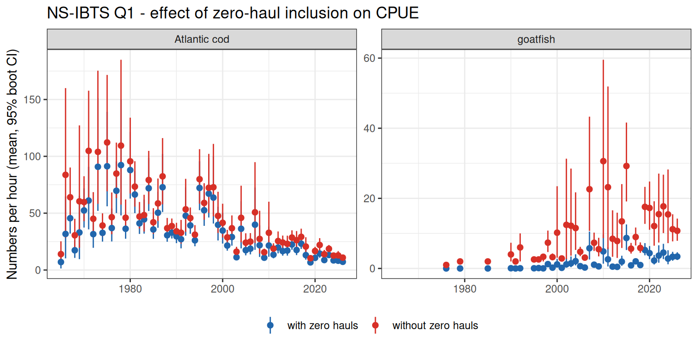
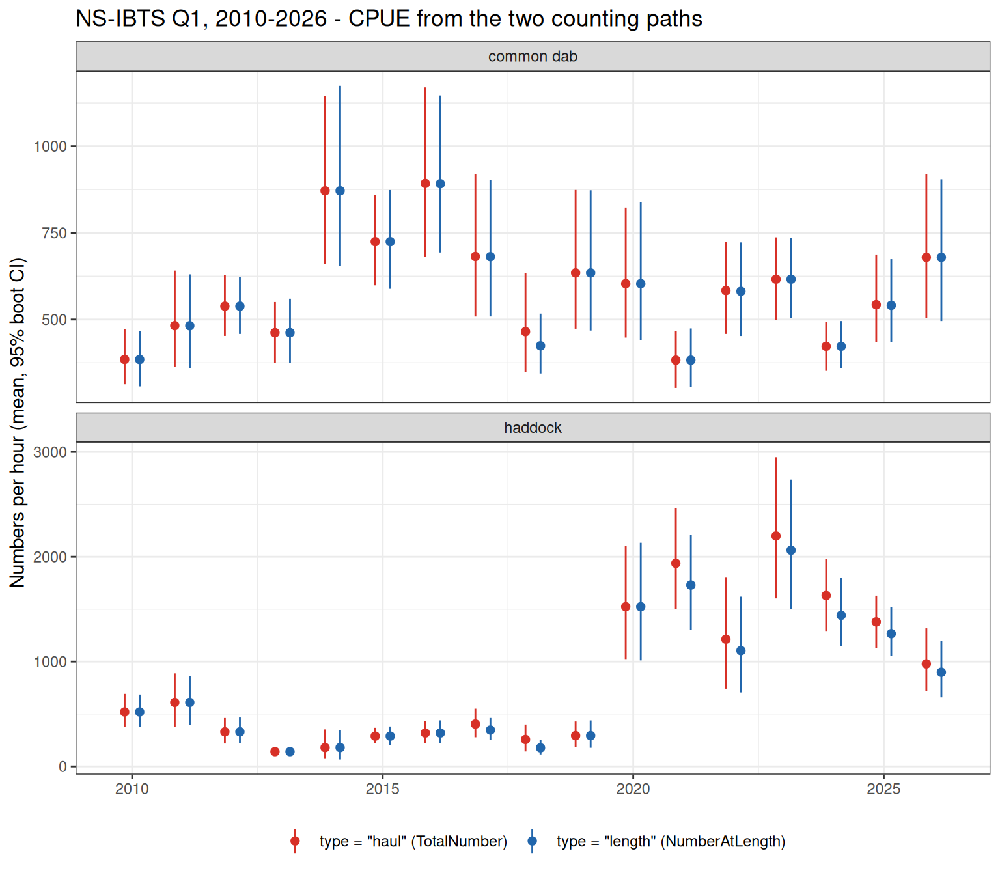
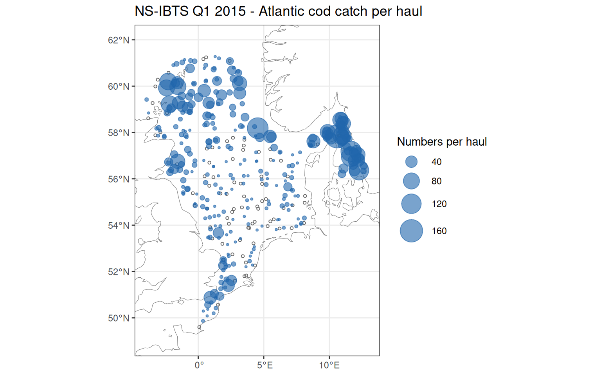
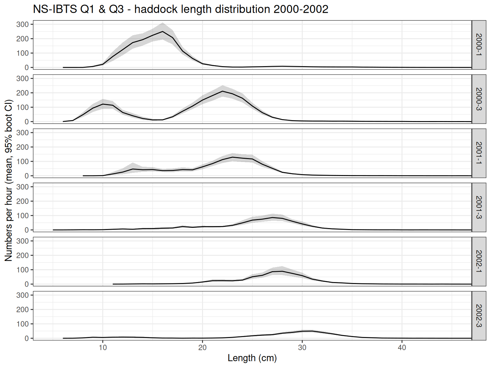
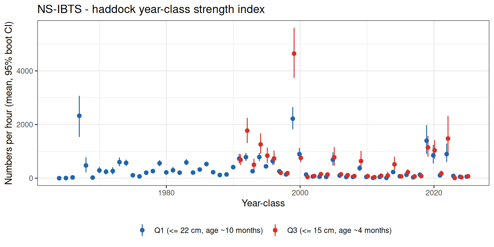
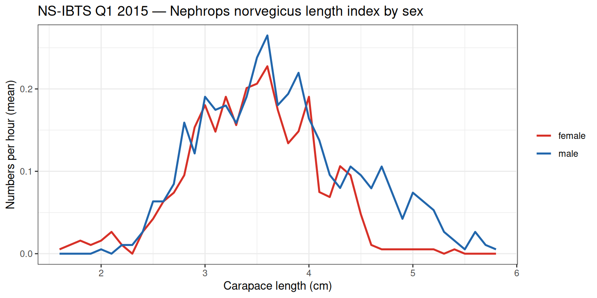
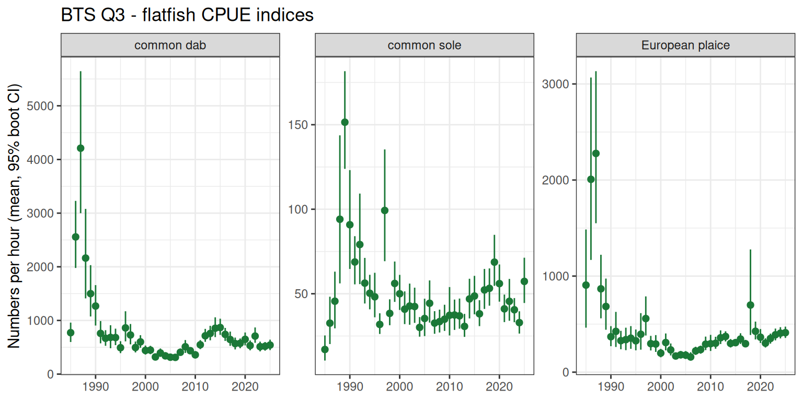
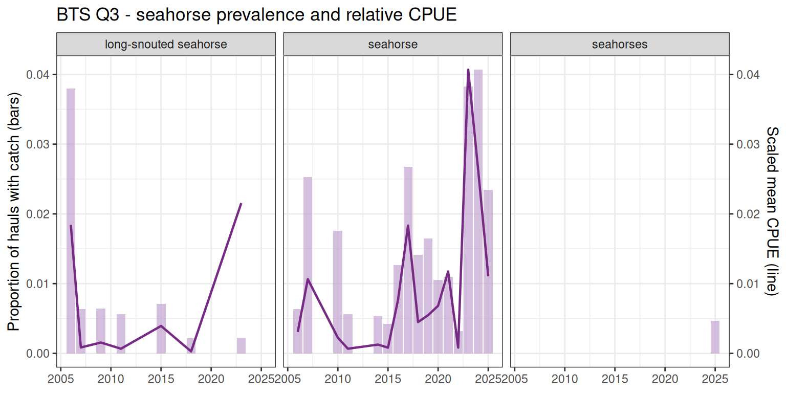
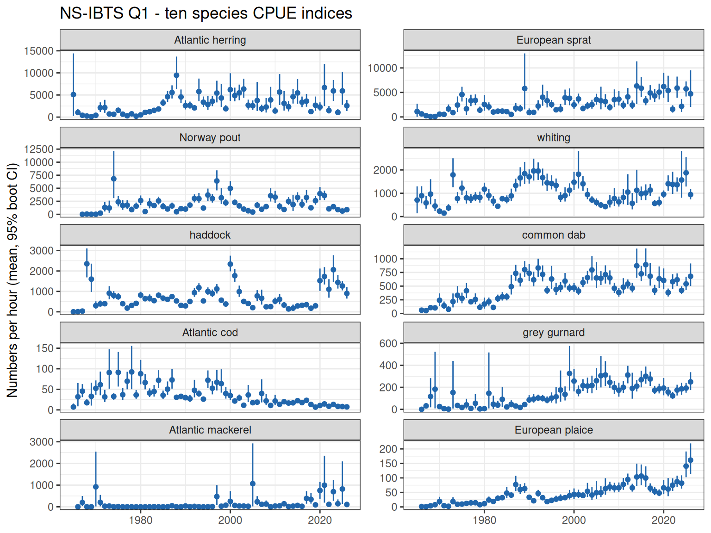

# Catch products: from raw exchange data to survey indices

Three functions cover most survey-index workflows. They are designed for
**interactive analysis**: lazy DuckDB queries, automatic zero-filling,
and a concise pipeline that goes from raw exchange data to a collected
data frame in a single chain. If instead you need a **shareable data
product** — a parquet file with unambiguous columns and protocol
metadata attached — see the [Standardized
HL](https://einarhjorleifsson.github.io/obus/articles/standardize_hl.qmd)
article.

| Function | Input | Output | Zero-fill |
|----|----|----|----|
| [`dr_HL_standardised()`](https://einarhjorleifsson.github.io/obus/reference/dr_HL_standardised.md) | raw HH + HL | one row per haul × species × length bin (type=“length”) | no |
| [`dr_catch_by_haul()`](https://einarhjorleifsson.github.io/obus/reference/dr_catch_by_haul.md) | output of above | one row per haul × species | yes |
| [`dr_expand_length()`](https://einarhjorleifsson.github.io/obus/reference/dr_expand_length.md) | output of above | one row per haul × species × length bin | yes |

The typical pipeline is:

    dr_HL_standardised(hh, hl) |> filter(type == "length")  →  dr_catch_by_haul(hh)
                                                             ↘  dr_expand_length(hh)

[`dr_HL_standardised()`](https://einarhjorleifsson.github.io/obus/reference/dr_HL_standardised.md)
reads the `NumberAtLength` field and applies DataType-aware subsampling
corrections. It returns only observed rows — no zeros — with species
names, length units, and protocol flags pre-attached. The downstream
functions add the zero hauls needed for unbiased CPUE estimation.

``` r

library(obus)
library(dplyr)
library(ggplot2)
library(Hmisc)  # required for stat_summary(fun.data = "mean_cl_boot")

hh  <- dr_con("HH")
hl  <- dr_con("HL")

# Build the base catch table once (lazy); filter downstream
# Previously: cbl <- dr_catch_by_length(hh, hl, haulval = "V")
cbl <- dr_HL_standardised(hh, hl, haulval = "V") |> filter(type == "length")

# Ensure DuckDB can write temp files for large spill-to-disk queries
local({
  tmp <- file.path(tempdir(), "duckdb_temp")
  dir.create(tmp, showWarnings = FALSE, recursive = TRUE)
  DBI::dbExecute(duckdbfs::cached_connection(),
                 sprintf("SET temp_directory='%s'", tmp))
})
```

    [1] 0

------------------------------------------------------------------------

## NS-IBTS Q1 — North Sea demersal survey

### Why zero hauls matter

Species are absent from many hauls. Dropping those zeros inflates the
mean CPUE and makes trends unreliable.
[`dr_catch_by_haul()`](https://einarhjorleifsson.github.io/obus/reference/dr_catch_by_haul.md)
adds an explicit zero row for every haul where a species was not caught
(within the same Survey/Year/Quarter stratum).

Goatfish (*Mullus surmuletus*) is a good illustration: it appears in
virtually every year since the late 1990s but is caught in only ~13 % of
hauls, and when present it arrives in schools giving a high CPUE.
Ignoring zero hauls overstates the mean by roughly 7-fold. Atlantic cod
shows the same bias, more so in recent decades as the stock declined and
hauls with no cod became the norm.

``` r

species_ns <- c("goatfish", "Atlantic cod")

cpue_ns <- cbl |>
  filter(Survey == "NS-IBTS", Quarter == 1, species %in% species_ns) |>
  dr_catch_by_haul(hh) |>
  collect()

bind_rows(
  cpue_ns                      |> mutate(zeros = "with zero hauls"),
  cpue_ns |> filter(n_hour > 0) |> mutate(zeros = "without zero hauls")
) |>
  ggplot(aes(Year, n_hour, colour = zeros)) +
  stat_summary(fun.data = "mean_cl_boot", geom = "pointrange", size = 0.3) +
  facet_wrap(~species, scales = "free_y") +
  scale_colour_manual(values = c("with zero hauls"    = "#2166ac",
                                 "without zero hauls" = "#d73027")) +
  labs(y = "Numbers per hour (mean, 95% boot CI)",
       x = NULL, colour = NULL,
       title = "NS-IBTS Q1 - effect of zero-haul inclusion on CPUE") +
  theme_bw() +
  theme(legend.position = "bottom")
```



### Which hauls get a zero row?

[`dr_catch_by_haul()`](https://einarhjorleifsson.github.io/obus/reference/dr_catch_by_haul.md)
and
[`dr_expand_length()`](https://einarhjorleifsson.github.io/obus/reference/dr_expand_length.md)
build their zero-fill species list by pooling across every haul in the
same Survey/Year/Quarter — a species gets a zero row in a haul if it was
caught *anywhere else* in that survey-year-quarter, regardless of
whether that particular haul was actually required to record it. This is
a deliberate match to how DATRAS’s own CPUE data products do it:

> “Information for a species in data products for the given year and
> quarter can only be found if at least one data submitter observed the
> species and reported it to DATRAS. Then 0-records will be
> automatically added to all hauls in the given year and quarter.”
>
> — ICES Data Centre, [*DATRAS
> FAQs*](https://www.ices.dk/data/Documents/DATRAS/DATRAS_FAQs.pdf)
> (DATRAS Guidelines Document, “ICES DATRAS FAQ For Data Users”, version
> 3, 2014)

This pooled rule matches the official DATRAS convention, but it can
still produce **phantom zeros**: if a haul was never required to record
a species at all, a “zero” there doesn’t distinguish “confirmed absent”
from “never checked.” Two HH columns exist for exactly this —
`StandardSpeciesCode` and `BycatchSpeciesCode`, documenting what a
vessel was required to record for that haul. ICES’s own
index-calculation methodology uses them for a further haul-*selection*
step: restricting which hauls are eligible to contribute to a
species-specific index —

> “If Bycatch species recording codes exist for a species then only
> hauls with all species reported or the selected species record is
> \[selected\]… If there is standard species then take only haul which
> has data of that standard species.”
>
> — ICES Data Centre, [*NS-IBTS Indices Calculation
> Procedure*](https://www.ices.dk/data/Documents/DATRAS/Indices_Calculation_Steps_IBTS.pdf)
> (DATRAS Procedure Document, 2022) and [*BITS Indices Calculation
> Procedure*](https://www.ices.dk/data/Documents/DATRAS/Indices_Calculation_Steps_BITS.pdf)
> (DATRAS Procedure Document, 2013)

obus doesn’t implement this haul-selection step yet —
[`dr_catch_by_haul()`](https://einarhjorleifsson.github.io/obus/reference/dr_catch_by_haul.md)
and
[`dr_expand_length()`](https://einarhjorleifsson.github.io/obus/reference/dr_expand_length.md)
zero-fill the CPUE-product way (above) and stop there. That’s also why
`StandardSpeciesCode`/`BycatchSpeciesCode` aren’t carried through
[`dr_HL_standardised()`](https://einarhjorleifsson.github.io/obus/reference/dr_HL_standardised.md)’s
output (see [Standardized
HL](https://einarhjorleifsson.github.io/obus/articles/standardize_hl.qmd)
for that design decision) — but they’re one join away from `hh` if you
want to build this filter yourself:

``` r

complete_hauls <- dr_HL_standardised(hh, hl, haulval = "V") |>
  filter(type == "haul") |>
  dplyr::left_join(dplyr::select(hh, .id, StandardSpeciesCode, BycatchSpeciesCode), by = ".id") |>
  filter(StandardSpeciesCode == "1",   # full standard species list
         BycatchSpeciesCode  != "0")   # some bycatch recording done
```

There’s also a separate, independent complication: the species codes
referenced by `StandardSpeciesCode`/`BycatchSpeciesCode` are
survey-specific, and which species each code actually covers — and
whether that list has changed over time within a survey — is not
something obus currently encodes. See the [Sampling
protocols](https://einarhjorleifsson.github.io/imbus/DATRAS/sampling_protocol.html)
article in the IMBUS documentation for a detailed treatment, including
examples of how ignoring these flags leads to phantom zeros and biased
CPUE indices.

### CPUE from the two counting paths — when do they agree?

`type == "length"` and `type == "haul"` give two independent CPUE series
for the same species — one from summed length-frequency counts, one from
the haul-level `TotalNumber`. They should track each other closely; a
persistent gap is a real signal, not noise (see [Standardized
HL](https://einarhjorleifsson.github.io/obus/articles/standardize_hl.qmd#length-totals-vs-haul-totals-should-match)).
Comparing the two on recent NS-IBTS years shows both cases: common dab’s
two series overlap almost exactly every year, while haddock’s
haul-derived CPUE sits consistently above its length-derived CPUE from
around 2020 onward — a real, if modest, systematic gap rather than
sampling noise.

``` r

species_cmp <- c("common dab", "haddock")
hh_ns1 <- hh |> filter(Survey == "NS-IBTS", Quarter == 1)
hl_ns1 <- hl |> filter(Survey == "NS-IBTS", Quarter == 1)
cmp_std <- dr_HL_standardised(hh_ns1, hl_ns1, haulval = "V") |>
  filter(species %in% species_cmp, Year >= 2010)

length_cpue <- cmp_std |> filter(type == "length") |> dr_catch_by_haul(hh_ns1) |> collect() |>
  mutate(source = "type = \"length\" (NumberAtLength)")
haul_cpue   <- cmp_std |> filter(type == "haul")   |> dr_catch_by_haul(hh_ns1) |> collect() |>
  mutate(source = "type = \"haul\" (TotalNumber)")

bind_rows(length_cpue, haul_cpue) |>
  filter(!is.na(n_hour)) |>
  mutate(species = factor(species, levels = species_cmp)) |>
  ggplot(aes(Year, n_hour, colour = source)) +
  stat_summary(fun.data = "mean_cl_boot", geom = "pointrange", size = 0.3,
               position = position_dodge(0.6)) +
  facet_wrap(~species, scales = "free_y", ncol = 1) +
  scale_colour_manual(values = c(
    "type = \"length\" (NumberAtLength)" = "#2166ac",
    "type = \"haul\" (TotalNumber)"      = "#d73027")) +
  labs(y = "Numbers per hour (mean, 95% boot CI)", x = NULL, colour = NULL,
       title = "NS-IBTS Q1, 2010-2026 - CPUE from the two counting paths") +
  theme_bw() +
  theme(legend.position = "bottom")
```



The reason that that dab data is in more than the haddock is likely
associated with species distribution in relation to Platform protocol.
Haddock’s gap traces to a specific, real submission pattern, not
measurement coverage: restricting the comparison to only the hauls where
haddock *was* individually measured (so `type == "length"` exists at
all) still shows the same gap concentrated from 2017 onward,
concentrated in `DataType == "P"` records. One 2024 haul illustrates the
mechanism directly — `TotalNumber = 2844` is reported identically across
three different `SpeciesCategory` strata (11, 12, 13) for the same haul
and species. The haul-path sums `TotalNumber` across strata (correctly,
per the DATRAS spec — different strata are meant to hold different
counts), so a repeated value here triples the haul-derived total for
that haul. This is exactly the kind of inconsistency
[`dr_check_totalno()`](https://einarhjorleifsson.github.io/obus/reference/dr_check_totalno.md)
is designed to flag (see [Standardized
HL](https://einarhjorleifsson.github.io/obus/articles/standardize_hl.qmd#length-totals-vs-haul-totals-should-match))
— a genuine data-submission issue, not a coverage gap like the one seen
for species that are rarely individually measured.

### Spatial distribution — catch per haul

A bubble plot on haul positions shows where a species is concentrated in
a given year. Here Atlantic cod in 2015; circle area is proportional to
numbers caught per haul (zero hauls shown as small open circles).

``` r

cod_hauls_2015 <- cbl |>
  filter(Survey == "NS-IBTS", Quarter == 1,
         species == "Atlantic cod", Year == 2015) |>
  dr_catch_by_haul(hh) |>
  left_join(select(hh, .id, ShootLongitude, ShootLatitude), by = ".id") |>
  collect()

ggplot(cod_hauls_2015,
       aes(ShootLongitude, ShootLatitude)) +
  geom_sf(data = dr_coastline, inherit.aes = FALSE,
          fill = "grey85", colour = "grey50", linewidth = 0.2) +
  geom_point(data = ~filter(.x, n_haul == 0),
             shape = 1, size = 1, colour = "grey40") +
  geom_point(data = ~filter(.x, n_haul > 0),
             aes(size = n_haul), colour = "#2166ac", alpha = 0.6) +
  scale_size_area(max_size = 10, name = "Numbers per haul") +
  coord_sf(xlim = c(-4, 13), ylim = c(49, 62)) +
  labs(x = NULL, y = NULL,
       title = "NS-IBTS Q1 2015 - Atlantic cod catch per haul") +
  theme_bw() +
  theme(legend.position = "right")
```



### Year-class progression in length distributions

The pipeline is not limited to a single quarter. Passing both Q1 and Q3
of NS-IBTS in one call shows how the same year-class shifts rightward
within a year as fish grow, and then again across years. Three years
bracketing the strong 2000 year-class illustrate this clearly — within
each year Q3 fish are noticeably larger than Q1 fish, and the dominant
cohort advances ~10 cm per year.

``` r

cbl |>
  filter(Survey == "NS-IBTS", Quarter %in% c(1, 3), species == "haddock",
         Year %in% 2000:2002) |>
  dr_expand_length(hh) |>
  collect() |>
  mutate(YQ = paste0(Year, "-", Quarter)) |> 
 # mutate(Quarter = paste0("Q", Quarter)) |>
  ggplot(aes(length_cm, n_hour)) +
  stat_summary(fun.data = "mean_cl_boot", geom = "ribbon",
               aes(ymin = after_stat(ymin), ymax = after_stat(ymax)),
               alpha = 0.2, colour = NA) +
  stat_summary(fun = mean, geom = "line") +
  #scale_fill_manual(values   = c(Q1 = "#2166ac", Q3 = "#d73027")) +
  #scale_colour_manual(values = c(Q1 = "#2166ac", Q3 = "#d73027")) +
  facet_grid(YQ ~ .) +
  labs(x = "Length (cm)", y = "Numbers per hour (mean, 95% boot CI)",
       fill = NULL, colour = NULL,
       title = "NS-IBTS Q1 & Q3 - haddock length distribution 2000-2002") +
  theme_bw() +
  theme(legend.position = "bottom") +
  coord_cartesian(xlim = c(5, 45))
```



### Juvenile index from length-structured data

Length-based indices require zero-filling at the length level before
aggregating — otherwise hauls where no small fish were caught are
silently dropped.
[`dr_expand_length()`](https://einarhjorleifsson.github.io/obus/reference/dr_expand_length.md)
ensures every haul contributes, including those with zero juveniles.

Haddock spawn in spring (March–May). The NS-IBTS runs in both Q1
(January–March) and Q3 (July–September), giving two windows onto the
same year-classes at different ages:

- **Q3 ≤ 15 cm**: 0-group fish (~3–4 months old), representing the
  year-class spawned that same spring (year-class *Y* seen in Q3 of year
  *Y*).
- **Q1 ≤ 22 cm**: 1-group fish (~10 months old), representing the
  year-class spawned the previous spring (year-class *Y*−1 seen in Q1 of
  year *Y*).

Aligning both to year-class puts them on the same axis and provides an
independent cross-check of year-class strength.

``` r

cbl |>
  filter(Survey == "NS-IBTS", Quarter %in% c(1, 3), species == "haddock") |>
  dr_expand_length(hh) |>
  collect() |>
  filter((Quarter == 1 & length_cm <= 22) | (Quarter == 3 & length_cm <= 15)) |>
  mutate(
    year_class = if_else(Quarter == 1, Year - 1L, Year),
    quarter_label = if_else(Quarter == 1,
                            "Q1 (<= 22 cm, age ~10 months)",
                            "Q3 (<= 15 cm, age ~4 months)")
  ) |>
  group_by(year_class, quarter_label, .id) |>
  summarise(n_hour = sum(n_hour), .groups = "drop") |>
  ggplot(aes(year_class, n_hour, colour = quarter_label)) +
  stat_summary(fun.data = "mean_cl_boot", geom = "pointrange",
               size = 0.3, position = position_dodge(0.4)) +
  scale_colour_manual(values = c("Q1 (<= 22 cm, age ~10 months)" = "#2166ac",
                                 "Q3 (<= 15 cm, age ~4 months)"  = "#d73027")) +
  labs(y = "Numbers per hour (mean, 95% boot CI)",
       x = "Year-class", colour = NULL,
       title = "NS-IBTS - haddock year-class strength index") +
  theme_bw() +
  theme(legend.position = "bottom")
```



### Sex-specific length indices — *Nephrops norvegicus*

[`dr_HL_standardised()`](https://einarhjorleifsson.github.io/obus/reference/dr_HL_standardised.md)
carries a `p_females` column — the proportion female among sexed
individuals at each length (see [Standardized
HL](https://einarhjorleifsson.github.io/obus/articles/standardize_hl.qmd#two-row-types-one-table)
for the formula and its `NA` semantics). Splitting `n_haul`/`n_hour`
into female and male components with `p_females`, then zero-filling each
component separately with
[`dr_expand_length()`](https://einarhjorleifsson.github.io/obus/reference/dr_expand_length.md),
gives a sex-specific length index — each sex is treated as its own
number-at-length series, so the existing zero-fill machinery applies
unchanged.

*Nephrops norvegicus* (Dublin Bay lobster) is a good candidate: it is
reliably sexed during sampling, so `p_females` is non-missing for over
90% of its NS-IBTS length records.

> **`p_females`-derived counts assume the catch is fully sexed**
>
> `n_haul * p_females` only equals the true female count when
> essentially all individuals at that length/haul were sexed (no
> `"B"`/`"U"`/unsexed catch). For Nephrops, with \> 90% sexing coverage,
> this is a safe approximation. For species recorded with substantial
> unsexed bycatch, treat the derived counts as indicative, not exact.

``` r

nephrops_2015 <- cbl |>
  filter(species == "Dublin Bay lobster",
         Survey == "NS-IBTS", Quarter == 1, Year == 2015,
         # carapace length in cm; a minority of records use a different
         # length convention (likely total length) and are excluded here
         length_cm <= 6, !is.na(p_females)) |>
  collect() |>
  mutate(n_females = n_haul * p_females, n_males = n_haul * (1 - p_females),
         h_females = n_hour * p_females, h_males   = n_hour * (1 - p_females))

hh_2015 <- hh |>
  filter(Survey == "NS-IBTS", Quarter == 1, Year == 2015, HaulValidity == "V") |>
  collect()

female_lf <- nephrops_2015 |>
  mutate(n_haul = n_females, n_hour = h_females) |>
  select(.id, Survey, Year, Quarter, aphia, latin, species,
         length_mm, length_cm, accuracy, n_haul, n_hour, SpeciesValidity) |>
  dr_expand_length(hh_2015) |>
  mutate(sex = "female")

male_lf <- nephrops_2015 |>
  mutate(n_haul = n_males, n_hour = h_males) |>
  select(.id, Survey, Year, Quarter, aphia, latin, species,
         length_mm, length_cm, accuracy, n_haul, n_hour, SpeciesValidity) |>
  dr_expand_length(hh_2015) |>
  mutate(sex = "male")

bind_rows(female_lf, male_lf) |>
  group_by(sex, length_cm) |>
  summarise(mean_n_hour = mean(n_hour, na.rm = TRUE), .groups = "drop") |>
  ggplot(aes(length_cm, mean_n_hour, colour = sex)) +
  geom_line(linewidth = 0.9) +
  scale_colour_manual(values = c(female = "#d73027", male = "#2166ac")) +
  labs(x = "Carapace length (cm)", y = "Numbers per hour (mean)",
       colour = NULL,
       title = "NS-IBTS Q1 2015 - Nephrops norvegicus length index by sex") +
  theme_bw()
```



Female and male numbers track closely up to ~4 cm, then female numbers
fall off sharply while male numbers persist into larger size classes —
males reach larger sizes than females in this species.

------------------------------------------------------------------------

## BTS Q3 — Southern North Sea flatfish survey

BTS covers the Dutch, Belgian and English coastal waters in summer.
Common dab and plaice dominate; this survey also records seahorses
consistently.

``` r

species_bts <- c("common dab", "European plaice", "common sole")

cbl |>
  filter(Survey == "BTS", Quarter == 3, species %in% species_bts) |>
  dr_catch_by_haul(hh) |>
  collect() |>
  ggplot(aes(Year, n_hour)) +
  stat_summary(fun.data = "mean_cl_boot", geom = "pointrange",
               colour = "#1b7837", size = 0.3) +
  facet_wrap(~species, scales = "free_y") +
  labs(y = "Numbers per hour (mean, 95% boot CI)",
       x = NULL,
       title = "BTS Q3 - flatfish CPUE indices") +
  theme_bw()
```



### Seahorse — a rare bycatch indicator

Seahorses (*Hippocampus* spp.) are rarely caught but their occurrence in
trawl surveys is used as an indicator of seagrass habitat condition. BTS
has the most consistent records in DATRAS.

``` r

seahorse_aphia <- cbl |>
  filter(Survey == "BTS", grepl("Hippocampus", latin)) |>
  distinct(aphia, latin, species) |>
  collect()

cbl |>
  filter(Survey == "BTS", aphia %in% !!seahorse_aphia$aphia) |>
  dr_catch_by_haul(hh) |>
  collect() |>
  mutate(present = n_hour > 0) |>
  group_by(Year, species) |>
  summarise(prevalence = mean(present),
            mean_cpue  = mean(n_hour),
            .groups = "drop") |>
  ggplot(aes(Year)) +
  geom_col(aes(y = prevalence), fill = "#c2a5cf", alpha = 0.7) +
  geom_line(aes(y = mean_cpue / max(mean_cpue) * max(prevalence)),
            colour = "#762a83", linewidth = 0.8) +
  facet_wrap(~species) +
  scale_y_continuous(
    name = "Proportion of hauls with catch (bars)",
    sec.axis = sec_axis(~ . * 1, name = "Scaled mean CPUE (line)")
  ) +
  labs(x = NULL,
       title = "BTS Q3 - seahorse prevalence and relative CPUE") +
  theme_bw()
```



------------------------------------------------------------------------

## How fast is it?

Ten of the most common NS-IBTS Q1 species — full CPUE pipeline from raw
exchange data through to a collected data frame, timed with
[`system.time()`](https://rdrr.io/r/base/system.time.html).

``` r

species_10 <- c(
  "Atlantic herring", "European sprat", "Norway pout",
  "whiting", "haddock", "common dab",
  "Atlantic cod", "grey gurnard", "Atlantic mackerel",
  "European plaice"
)

t <- system.time(
  cpue_10 <- cbl |>
    filter(Survey == "NS-IBTS", Quarter == 1, species %in% species_10) |>
    dr_catch_by_haul(hh) |>
    collect()
)

cat(sprintf("10 species, all NS-IBTS Q1 years: %.1f s\n", t["elapsed"]))
```

    10 species, all NS-IBTS Q1 years: 6.1 s

``` r

cpue_10 |>
  mutate(species = factor(species, levels = species_10)) |>
  ggplot(aes(Year, n_hour)) +
  stat_summary(fun.data = "mean_cl_boot", geom = "pointrange",
               colour = "#2166ac", size = 0.2) +
  facet_wrap(~species, scales = "free_y", ncol = 2) +
  labs(y = "Numbers per hour (mean, 95% boot CI)", x = NULL,
       title = "NS-IBTS Q1 - ten species CPUE indices") +
  theme_bw()
```



------------------------------------------------------------------------

## A note on `dr_expand_length()` and large selections

[`dr_expand_length()`](https://einarhjorleifsson.github.io/obus/reference/dr_expand_length.md)
builds a **complete haul × species × length-bin grid**, so output size
grows as
$`N_\text{hauls} \times N_\text{species} \times N_\text{length bins}`$.
Even so, the DuckDB backend handles surprisingly large jobs efficiently.

``` r

t10 <- system.time(
  res10 <- cbl |>
    filter(Survey == "NS-IBTS", Quarter == 1, species %in% species_10) |>
    dr_expand_length(hh) |>
    collect()
)

cat(sprintf("10 species: %s rows - %.1f s\n",
            format(nrow(res10), big.mark = ","), t10["elapsed"]))
```

    10 species: 14,677,149 rows - 12.9 s

Running the same pipeline over all species in NS-IBTS Q1 — every year,
every species — takes tens of seconds and produces millions of rows. The
only real limit is R memory: the lazy query is always safe, but
[`collect()`](https://dplyr.tidyverse.org/reference/compute.html) across
multiple surveys simultaneously may exceed available RAM.

``` r

t_all <- system.time(
  res_all <- cbl |>
    filter(Survey == "NS-IBTS", Quarter == 1) |>
    dr_expand_length(hh) |>
    collect()
)

cat(sprintf("all species: %s rows - %.1f s\n",
            format(nrow(res_all), big.mark = ","), t_all["elapsed"]))
```

> **When to use
> [`dr_catch_by_haul()`](https://einarhjorleifsson.github.io/obus/reference/dr_catch_by_haul.md)
> vs
> [`dr_expand_length()`](https://einarhjorleifsson.github.io/obus/reference/dr_expand_length.md)**
>
> Use
> [`dr_catch_by_haul()`](https://einarhjorleifsson.github.io/obus/reference/dr_catch_by_haul.md)
> when you only need haul-level totals — it skips the length grid
> entirely and is substantially faster. Reserve
> [`dr_expand_length()`](https://einarhjorleifsson.github.io/obus/reference/dr_expand_length.md)
> for analyses that genuinely need the length structure: length-based
> indices, year-class tracking, or age-length keys.
